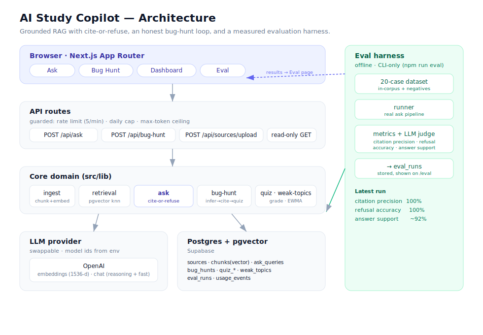

# AI Study Copilot — Grounded Study Assistant

A study copilot that **answers only from your uploaded materials, cites the exact source chunks it used, and refuses to hallucinate** when the answer isn't in your notes. Bug-hunt mode turns a mistake in your code into a cited concept review plus targeted practice — and a live **evaluation dashboard** proves the grounding quality with real metrics.

Built as a focused demonstration of trustworthy, enterprise-style AI: retrieval grounding, hallucination guardrails, and measurable evaluation.

**[Live demo](https://ai-study-copilot-cyan.vercel.app/)** · **[Case study](CASE_STUDY.md)** — the why, the architecture, and the eval-driven 28%→100% citation-precision story.



## Why this design

Most "chat with your notes" apps will happily make things up. This one treats grounding as the core contract:

- **Cite or refuse.** Every answer is built strictly from retrieved chunks and cites them, or returns a clear "not found in your materials" — never a fabricated citation.
- **Honest about inference.** Bug diagnosis is labeled *model inference* (it comes from the model's reasoning, not your notes). Citations are reserved for the concept that's actually retrieved from your materials.
- **Measured, not claimed.** An eval harness scores citation precision, refusal accuracy, and answer support rate over a seeded question set.

## Evaluation

A fixed 20-question eval set runs through the real ask pipeline — answerable questions from the notes plus plausible out-of-corpus questions (Dijkstra, B-trees, Kubernetes) that must be refused. Three honest metrics, viewable on the `/eval` dashboard:

| Metric | Latest run | What it measures |
| --- | --- | --- |
| Citation precision | **100%** | Of the sources an answer cites, the fraction that are the correct source |
| Refusal accuracy | **100%** | How often the answer-vs-refuse gate makes the right call |
| Answer support | **~92%** | Fraction of answer claims backed by the cited excerpts (LLM judge) |

Runs are CLI-only (`npm run eval`) so the public demo can't be made to spend on model calls; the dashboard is read-only. See `src/eval/`.

## Production safeguards

Because the demo is public and backed by a paid model API, the API routes are protected against runaway cost and abuse:

- **Per-IP rate limiting** and a **global daily request cap** (DB-backed, so they hold across serverless instances) — see `src/lib/rate-limit.ts`.
- **`max_completion_tokens` ceiling** on every model call to bound per-request cost.
- Secrets are server-side only (no `NEXT_PUBLIC_` exposure); IPs are stored hashed.

## Stack

- **Next.js (App Router) + TypeScript**, Tailwind CSS
- **Postgres + pgvector** (Supabase) via **Drizzle ORM**
- **OpenAI** for embeddings + completions, behind a thin swappable provider (`src/lib/llm/provider.ts`) — model ids are env-driven
- **Vitest** (unit) + **Playwright** (e2e)

## Getting started

1. **Install**
   ```bash
   npm install
   ```

2. **Configure env** — copy `.env.example` to `.env.local` and fill in:
   - `DATABASE_URL` — Supabase Postgres connection string (Transaction pooler, port 6543)
   - `OPENAI_API_KEY`
   - Model ids (`OPENAI_REASONING_MODEL`, `OPENAI_FAST_MODEL`, `OPENAI_EMBEDDING_MODEL`) are pre-filled.

3. **Create the schema** (enables pgvector + creates all tables)
   ```bash
   npm run db:migrate
   ```

4. **Seed sample DSA/cloud notes** (optional, makes the demo work immediately)
   ```bash
   npm run db:seed
   ```

5. **Run**
   ```bash
   npm run dev
   ```
   Open http://localhost:3000 — paste notes, then ask a grounded question.

## Scripts

| Script | Purpose |
| --- | --- |
| `npm run dev` | Start the dev server |
| `npm run db:generate` | Generate a migration from the Drizzle schema |
| `npm run db:migrate` | Apply migrations (enables pgvector, creates tables) |
| `npm run db:seed` | Load a small DSA + cloud corpus |
| `npm test` | Run unit tests |
| `npm run test:e2e` | Run Playwright e2e tests |

## Project layout

```
src/
  app/
    api/sources/upload/route.ts  Ingest notes/PDF -> chunk -> embed -> store
    api/ask/route.ts             Grounded Q&A (cite-or-refuse)
    page.tsx                     Upload + Ask UI
  db/
    schema.ts                    9 tables incl. pgvector chunk store
    index.ts                     Drizzle client
  lib/
    env.ts                       Validated, env-driven config
    chunk.ts                     Deterministic text chunker (unit-tested)
    ingest.ts                    Ingestion pipeline + PDF extraction
    retrieval.ts                 pgvector search + grounding decision
    ask.ts                       Grounded answering logic
    llm/provider.ts              Swappable LLM boundary
```

## Status

- **Week 1 — done.** Ingestion, grounded ask (cite-or-refuse), UI, deployed live.
- **Week 2 — done.** Bug-Hunt mode (diagnosis labeled as model inference → cited concept from notes → grounded practice questions), server-side quiz grading, and EWMA weak-topic tracking.
- **Week 3 — done.** Evaluation harness + `/eval` dashboard (citation precision, refusal accuracy, answer support) and a `/dashboard` for coverage + weak topics.
- **Next:** Week 4 polish + written case study.
